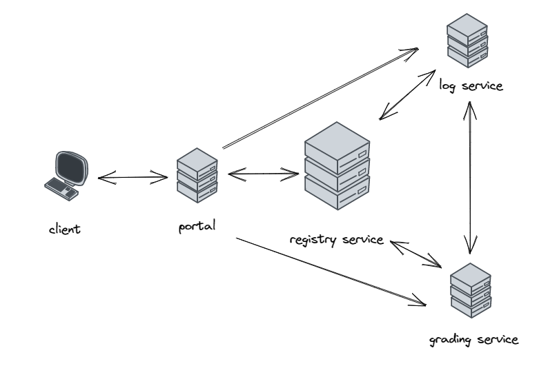
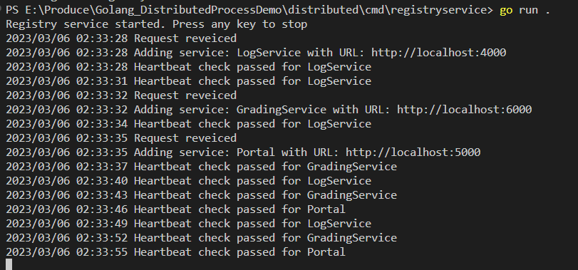
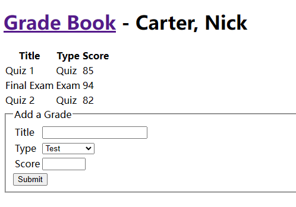
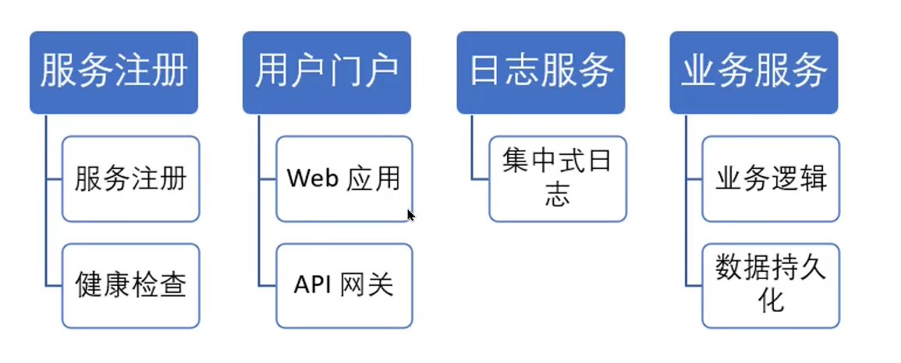
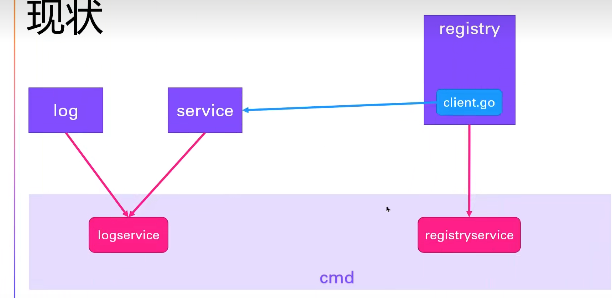

# README

This is a distributed system demo using golang. It contains service register, user portal, log service, transaction service.

It use **Service Discovery** to finish service register, add/remove patched services. For example, here it use register service to add a log service to a service which record grade of student.

It use **Heartbeat** as method of **Health Check**.

code in branch [go_src](https://github.com/DuGuYifei/Golang_DistributedSystemDemo/tree/go_src)

Learn from tutorial [source](https://www.bilibili.com/video/BV1ZU4y1577q)

Part about front-end(portal) is download from resource directly.

## main component

- service register
  - service register
  - health check
- user portal
  - web app
  - api gateway
- log service
  - centralized log
- business service
  - business logic
  - data persistence

### register service e.g. log

log service can be add as a patch to other business services.

